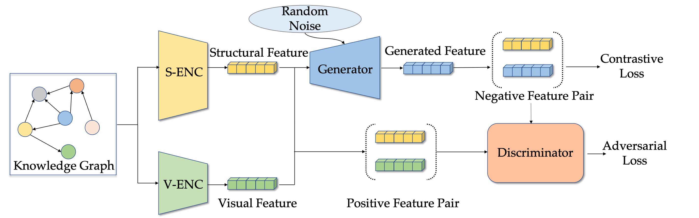

# MACO: A Modality Adversarial and Contrastive Framework for Modality-missing Multi-modal Knowledge Graph Completion

[](https://github.com/zjukg/MACO/main/LICENSE)
[](http://tcci.ccf.org.cn/conference/2023/)
[](https://pytorch.org/)
 - [*MACO: A Modality Adversarial and Contrastive Framework for Modality-missing Multi-modal Knowledge Graph Completion*](https://arxiv.org/abs/2308.06696)

> Recent years have seen significant advancements in multi-modal knowledge graph completion (MMKGC). MMKGC enhances knowledge graph completion (KGC) by integrating multi-modal entity information, thereby facilitating the discovery of unobserved triples in the large-scale knowledge graphs (KGs). Nevertheless, existing methods emphasize the design of elegant KGC models to facilitate modality interaction, neglecting the real-life problem of missing modalities in KGs. The missing modality information impedes modal interaction, consequently undermining the model's performance. In this paper, we propose a modality adversarial and contrastive framework (MACO) to solve the modality-missing problem in MMKGC. MACO trains a generator and discriminator adversarially to generate missing modality features that can be incorporated into the MMKGC model. Meanwhile, we design a cross-modal contrastive loss to improve the performance of the generator. Experiments on public benchmarks with further explorations demonstrate that MACO could achieve state-of-the-art results and serve as a versatile framework to bolster various MMKGC models.


## 🌈 Model Architecture


## 📕 Code Path
The code will be released soon!

## 💡 Related Works
There are also some other works about multi-modal knowledge graphs from ZJUKG team. If you are interest in multi-modal knowledge graphs, you could have a look at them:

### Multi-modal Entity Alignment
- (ACM MM 2023) [MEAformer: Multi-modal Entity Alignment Transformer for Meta Modality Hybrid](https://github.com/zjukg/MEAformer)
- (ISWC 2023) [Rethinking Uncertainly Missing and Ambiguous Visual Modality in Multi-Modal Entity Alignment](https://github.com/zjukg/UMAEA)

### Multi-modal Knowledge Graph Completion
- (SIGIR 2022) [Hybrid Transformer with Multi-level Fusion for Multimodal Knowledge Graph Completion](https://github.com/zjukg/MKGformer)
- (IJCNN 2023) [Modality-Aware Negative Sampling for Multi-modal Knowledge Graph Embedding](https://github.com/zjukg/MANS)

### Knowledge Graph with Large Language Models
- [KG-LLM-Papers](https://github.com/zjukg/KG-LLM-Papers)

### Open-source Tools
- [NeuralKG](https://github.com/zjukg/NeuralKG)

## 🤝 Cite:
Please condiser citing this paper if you use the code from our work.
Thanks a lot :)

```bigquery
@article{zhang2023maco,
  title={MACO: A Modality Adversarial and Contrastive Framework for Modality-missing Multi-modal Knowledge Graph Completion},
  author={Zhang, Yichi and Chen, Zhuo and Zhang, Wen},
  journal={arXiv preprint arXiv:2308.06696},
  year={2023}
}
```
